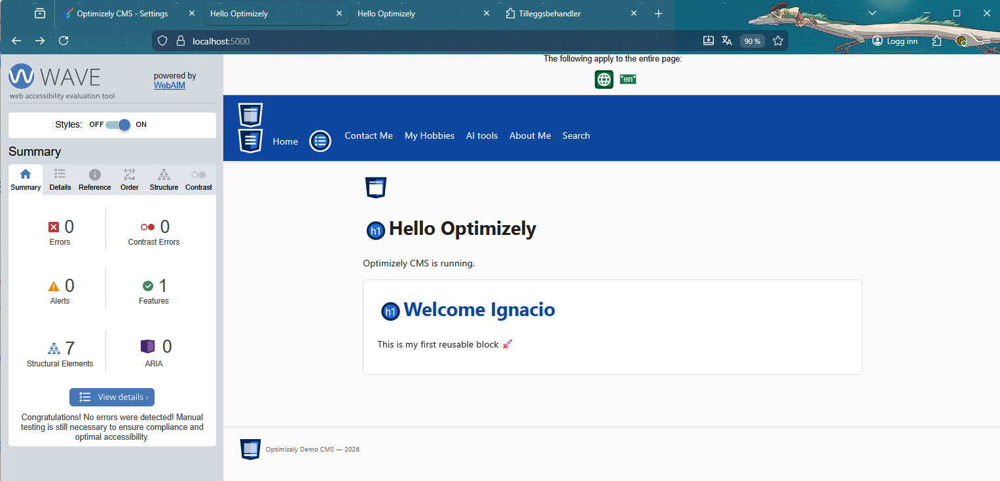

# Optimizely Demo CMS

Demo site on **Optimizely CMS 12 / .NET 8** for learning and practising testing (unit, integration, E2E). Based on a phased roadmap (0–5) implemented to date.

---

## Current status: phases 0–5 completed

### Phase 0 — Baseline
- Standard structure: `Models/Pages`, `Models/Blocks` (folder `Blokcs`), `Controllers`, `Views/Pages`, `Views/Shared/Blocks`, `wwwroot`.
- StartPage at `/` with MainHeading and HeroArea.
- `launchSettings.json` and `appsettings.Development.json` configured.
- Project builds and runs without critical warnings.

### Phase 1 — Content model (Pages, Blocks)
- **Pages**
  - **StartPage:** MainHeading, HeroArea, TopContentArea, MainContentArea.
  - **StandardPage:** Heading, MainBody (XhtmlString), MainContentArea.
  - **NotFoundPage:** Heading, Message (XhtmlString); used for 404.
- **Blocks**
  - **HeroBlock:** Heading, Text (XhtmlString), Image (ContentReference with UIHint "Image").
  - **RichTextBlock:** Heading, Body (XhtmlString).
  - **CTABlock:** Heading, Text, Link (LinkItemCollection), ButtonLabel.
- **Controllers and views:** StartPageController, StandardPageController, NotFoundPageController; views in `Views/StartPage`, `Views/StandardPage`, `Views/NotFoundPage`. Blocks rendered via components (`HeroBlockComponent`, `RichTextBlockComponent`, `CTABlockComponent`) and views in `Views/Shared/Blocks`.
- **Personal pages (menu: About Me, AI tools, My Hobbies, Contact Me):** **AboutMePage**, **AIToolsPage**, **HobbiesPage**, **ContactPage** with sidebar layout (`_PersonalLayout.cshtml`, `wwwroot/css/personal.css`). Pre-filled content: profile (certifications, work experience, skills), AI tools list, hobbies list. Create one page of each type under StartPage in CMS to show them in the top nav and in the sidebar on those pages.

### Phase 2 — Layout and navigation
- **Layout:** `Views/Shared/_Layout.cshtml` with header, nav, main, footer; `_ViewStart.cshtml` applies the default layout.
- **Navigation:** menu from children of StartPage (IContentLoader, FilterContentForVisitor, VisibleInMenu); Search link in the menu.
- **Styles:** `wwwroot/css/site.css` (CSS variables, header, nav, hero, CTA, footer, 404, search).
- **SEO in head:** title from ViewData; meta description and canonical when views set them.

### Phase 3 — Editorial rules and CMS UX
- **Tabs:** On StartPage, **"Header"** tab (MainHeading, HeroArea) and **"Content"** tab (TopContentArea, MainContentArea); **"SEO"** tab on StartPage and StandardPage.
- **Validation:** `[Required]` on MainHeading (StartPage) and Heading (StandardPage).
- **ContentArea restrictions:**
  - **HeroArea:** only `HeroBlock` (`[AllowedTypes(typeof(HeroBlock))]`).
  - **TopContentArea and MainContentArea (StartPage), MainContentArea (StandardPage):** HeroBlock, RichTextBlock, CTABlock.
- Display, Description and Order consistent across models.

### Phase 4 — SEO, 404, search, localization
- **SEO**
  - StartPage and StandardPage: **MetaTitle**, **MetaDescription**, **CanonicalUrl** properties (SEO tab).
  - Layout: `<title>`, `<meta name="description">`, `<link rel="canonical">` from ViewData (page views set MetaTitle, MetaDescription, CanonicalUrl).
- **404 and errors**
  - **NotFoundPage** content type (Heading, Message).
  - **StatusCodeController** at `/statuscode/{statusCode}`; for 404 it tries to load a CMS page of type NotFoundPage named "404" under StartPage; if none exists, uses the static view `Views/StatusCode/404.cshtml`.
  - `UseStatusCodePagesWithReExecute("/statuscode/{0}")` in Startup.
- **Search**
  - Route **/search**, parameter **q**; simple search by title across all pages that are descendants of StartPage (recursive with IContentLoader).
  - SearchController + view with form and results list; IUrlResolver for URLs.
- **Localization**
  - `[CultureSpecific]` on: MainHeading, Heading, MetaTitle, MetaDescription (StartPage and StandardPage); Heading and Message (NotFoundPage).
  - Languages are enabled in CMS Admin (Manage websites → Languages).

### Phase 5 — Observability and test hooks
- **Health endpoint**
  - **`/health`**: overall status (all checks). JSON response with `status`, `totalDuration`, `entries`. 200 if Healthy, 503 if Unhealthy.
  - **`/health/ready`**: only checks with tag `ready` (readiness for orchestration). Includes **CmsReadinessHealthCheck**: verifies that the Start page is configured and loadable (Healthy/Degraded/Unhealthy).
  - Response in JSON (HealthResponseWriter) for smoke tests and orchestrators.
- **Structured logging**
  - **Serilog** configured in `Program.cs` and `appsettings.json` / `appsettings.Development.json`.
  - Enrichment: `FromLogContext`, `Application` property.
  - In Development: level `Debug` for `OptiDemoCms`; in production, `Information`/`Warning` per configuration.
- **Reproducibility and seed data**
  - Documentation in **`Docs/Reproducibility.md`**: use of `/health` and `/health/ready` as test hooks, seed data options (export/import, script, DB copy), and recommendation to wait for `/health/ready` to return 200 before smoke tests.
  - No automatic content seed; the Start page is created in the CMS on first run.

### Testing (integration tests)
- **Project:** `OptiDemoCms.Tests` (xUnit, FluentAssertions, Microsoft.AspNetCore.Mvc.Testing).
- **Factory:** `OptiDemoCmsWebApplicationFactory` inherits from `WebApplicationFactory<Startup>`.
- **Tests in HomePageIntegrationTests:**
  - `/` returns 200 and HTML.
  - Response contains: `data-testid="start-page"`, `data-testid="main-heading"`, `data-testid="main-content"`, `data-testid="site-header"`, `data-testid="site-footer"`, `data-testid="site-nav"` and the text "Optimizely CMS is running".
- **Tests in HealthEndpointIntegrationTests (smoke):**
  - `/health` and `/health/ready` return 200 or 503 and `application/json`.
  - Response body of `/health` contains the `status` property.
- **Run tests:** `dotnet test OptiDemoCms.Tests/OptiDemoCms.Tests.csproj`  
  **Important:** stop any running `dotnet run` before running tests (the executable is locked).
- The test project folder is excluded from the main project (`OptiDemoCms.csproj`) so its `.cs` files are not compiled into the web app.

### Cypress E2E (UI tests)
- **Project:** `cypress-e2e/` (Node.js; Cypress 13).
- **Prerequisites:** Node.js 18+, app running at `https://localhost:5000`.
- **Setup:** `cd cypress-e2e && npm install`
- **Run:** `npm run cy:open` (interactive) or `npm run cy:run` (headless).
- **Specs:** `home.cy.js` (StartPage), `search.cy.js`, `not-found.cy.js`, `health.cy.js`, `personal-pages.cy.js`; use `data-testid` selectors.
- See **`cypress-e2e/README.md`** for details.

### Playwright E2E (public + CMS UI)
- **Project:** `tests-playwright/` (Node.js; Playwright, TypeScript).
- **Prerequisites:** Node.js 18+, app running at `https://localhost:5000`.
- **Setup:** `cd tests-playwright && npm install && npx playwright install chromium`
- **Run:** `npm run test` (all), `npm run test:public` (public only), `npm run test:ui` (UI mode). CMS tests require running `npm run cms:login` first (set `CMS_USER` / `CMS_PASS`).
- **Specs:** Public — `home.spec.ts`, `navigation.spec.ts`, `hero-block-render.spec.ts`, `home.visual.spec.ts`; CMS — `login.setup.ts`, `create-hero-block.spec.ts`, `add-block-to-home.spec.ts`, `publish-home.spec.ts` (scaffold; use codegen to complete).
- Anti-flakiness: `test-utils/stabilize.ts` (animations off, networkidle), `ignoreHTTPSErrors`, deterministic waits.
- See **`tests-playwright/README.md`** for details.

### Ready for more tests
- **data-testid** in views: start-page, main-heading, hero-area, main-content-area, site-header, site-nav, site-footer, standard-page, page-heading, main-body, rich-text-block, cta-block, cta-button, search-page, search-form, search-input, search-submit, search-results, not-found-page, not-found-heading, not-found-home-link, etc.

---

## Project structure (summary)

```
Optimizely/
├── Controllers/          StartPage, StandardPage, NotFoundPage, AboutMe, AITools, Hobbies, Contact, Search, StatusCode
├── Components/           HeroBlock, RichTextBlock, CTABlock
├── Health/               CmsReadinessHealthCheck, HealthResponseWriter
├── Models/               StartPage, StandardPage, NotFoundPage
├── Models/Blokcs/        HeroBlock, RichTextBlock, CTABlock
├── Views/
│   ├── StartPage/        Index.cshtml
│   ├── StandardPage/     Index.cshtml
│   ├── NotFoundPage/     Index.cshtml
│   ├── Search/           Index.cshtml
│   ├── Shared/           _Layout.cshtml, Blocks/*.cshtml
│   └── StatusCode/       404.cshtml
├── Docs/                 Reproducibility.md
├── wwwroot/css/          site.css
├── OptiDemoCms.Tests/    WebApplicationFactory, HomePageIntegrationTests, HealthEndpointIntegrationTests
├── cypress-e2e/          Cypress E2E tests (home, search, not-found, health, personal-pages)
├── tests-playwright/     Playwright E2E (public + CMS UI; stabilize, visual snapshots)
├── Program.cs, Startup.cs, OptiDemoCms.csproj
└── README.md
```

---

## How to run

### Windows
- **Requirements:** .NET SDK 8+, SQL Server 2016 Express LocalDB (or later).
- `dotnet run`

### Docker
- **Requirements:** Docker; review variables in `.env` if applicable.
- `docker-compose up`  
- For local development only; see [HTTPS guide](https://github.com/dotnet/dotnet-docker/blob/main/samples/run-aspnetcore-https-development.md) if needed.

### External database
- **Requirements:** .NET SDK 8+, SQL Server on an external server (e.g. Azure SQL).
- Create an empty database and update the connection string; then `dotnet run`.

---

## Suggested next steps

- **Tests:** Refine integration tests (StandardPage, /search, 404); unit tests (model validation); optional: Playwright for E2E smoke tests.

---

## Accessibility (WAVE)

First accessibility check with [WAVE](https://wave.webaim.org/) (WebAIM) on the home page: no errors, no contrast errors, no alerts. Manual testing is still recommended for full compliance.


