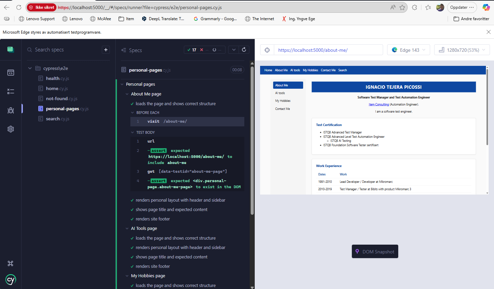
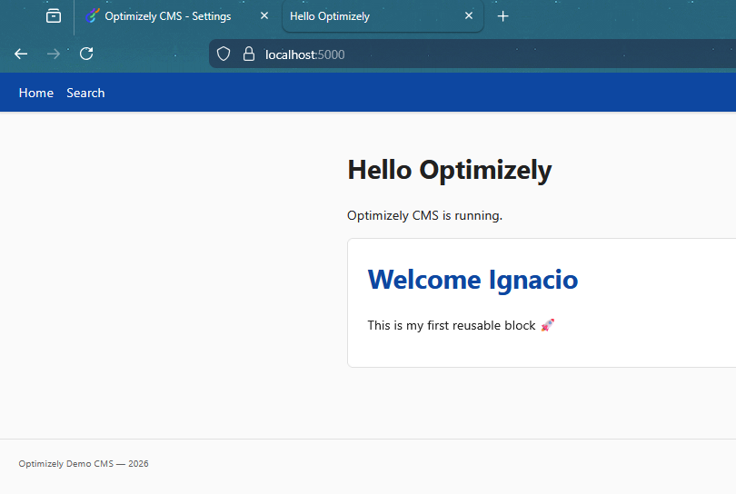
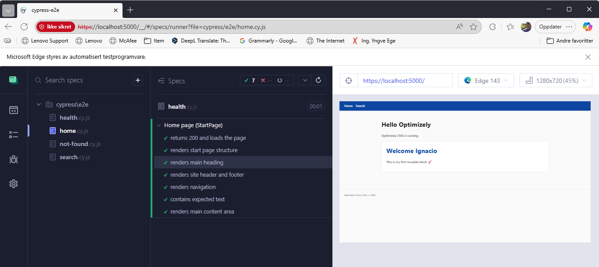
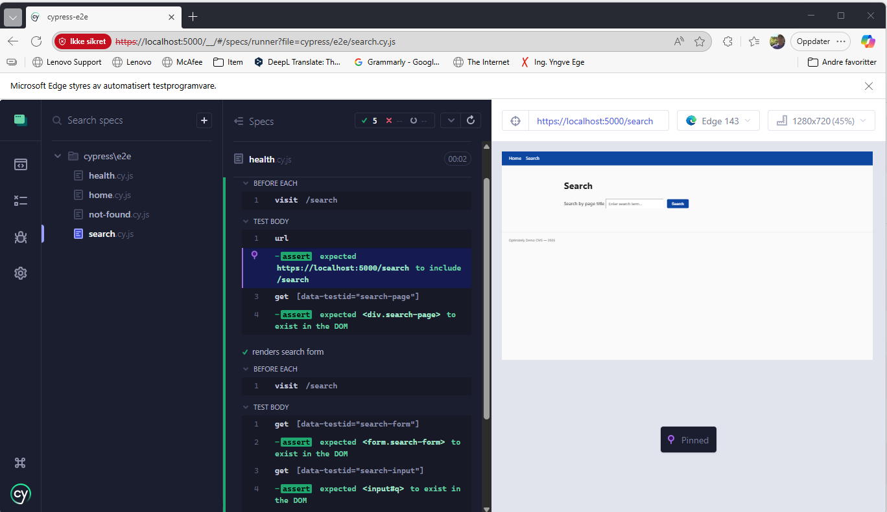

# Cypress E2E tests for Optimizely Demo CMS

UI (browser) tests using [Cypress](https://www.cypress.io/). The app must be running (e.g. `dotnet run` from the project root) before running tests.

## Example: Optimizely home page and Cypress tests passing

The screenshots below show the Optimizely Demo CMS home page (“Hello Optimizely”, with a reusable block “Welcome Ignacio”) and the Cypress test runner with all tests passing.

**Expanded test coverage – 17 tests (including personal pages)**



**Home page (StartPage) in the browser**



**Cypress: Home page (StartPage) tests – 7 passing**



**Cypress: Search page tests – 5 passing**



---

## Prerequisites

- Node.js 18+ (LTS)
- App running at **https://localhost:5000** (default from `launchSettings.json`)

## Setup

```bash
cd cypress-e2e
npm install
```

## Run tests

**Interactive (Cypress UI):**

```bash
npm run cy:open
```

**Headless (CI):**

```bash
npm run cy:run
```

Or:

```bash
npx cypress run
```

## Test suites

| Spec | Description |
|------|-------------|
| `home.cy.js` | Home page (StartPage): structure, main heading, header, footer, nav, expected text |
| `search.cy.js` | Search page: form, input, submit |
| `not-found.cy.js` | 404 page: not-found structure, home link, navigation back |
| `health.cy.js` | Health endpoints: `/health` and `/health/ready` return JSON with `status` |
| `personal-pages.cy.js` | About Me, AI tools, My Hobbies, Contact Me: load, layout (header, sidebar), content, footer; home nav links to all four |

Tests use `data-testid` attributes where available for stable selectors.

## Configuration

- **Base URL:** `https://localhost:5000` (see `cypress.config.js`)
- **Self-signed cert:** `chromeWebSecurity: false` so the dev server’s HTTPS cert is accepted
- To use another URL, set `baseUrl` in `cypress.config.js` or override with `CYPRESS_BASE_URL`

## One-liner (from repo root)

With the app already running in another terminal:

```bash
cd cypress-e2e && npm install && npm run cy:run
```
